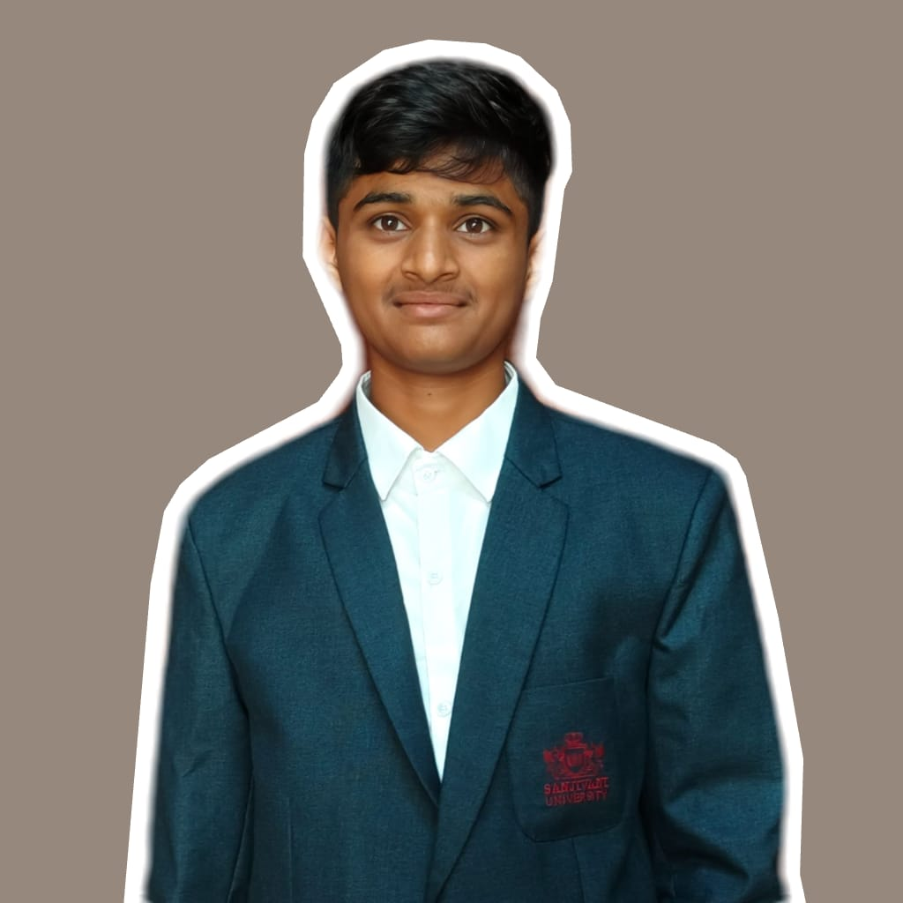

 
<html lang="en">
<head>
<meta charset="UTF-8">
<meta name="viewport" content="width=device-width, initial-scale=1.0">
<title>Prasad Sudhir Thorat — Cybersecurity & AI Portfolio</title>
<link rel="preconnect" href="https://fonts.googleapis.com">
<link href="https://fonts.googleapis.com/css2?family=JetBrains+Mono:wght@400;500;700;800&family=Inter:wght@400;500;600;700&display=swap" rel="stylesheet">

</head>
<body>

<!-- Interactive Background -->
<canvas id="network-canvas"></canvas>

<!-- Custom Cursor -->

  <nav>
    
 Sai~Prasad

    

      <a href="#about" class="hover-target">about</a>
      <a href="#skills" class="hover-target">skills</a>
      <a href="#experience" class="hover-target">experience</a>
      <a href="#certifications" class="hover-target">certs</a>
      <a href="#achievements" class="hover-target">events</a>
      <a href="#contact" class="hover-target">contact</a>
    

  </nav>

  <header class="hero">
    

    

      

        

          
        

      

      

        <h1 class="glitch" data-text="Prasad Sudhir Thorat">Prasad Sudhir Thorat</h1>
        
> B.Tech (Integrated) CSE | Cybersecurity | AI/Cloud

        
Sanjivani University, Kopargaon — 2nd Year

        
Building a foundation across cybersecurity, cloud infrastructure, and applied AI — one certification, workshop, and hands-on project at a time. Breaking systems to understand how to secure them.

        

          <a href="Prasad_Thorat_Resume.pdf" download class="btn btn-primary hover-target">
            <svg width="16" height="16" viewBox="0 0 24 24" fill="none" stroke="currentColor" stroke-width="2"><path d="M21 15v4a2 2 0 0 1-2 2H5a2 2 0 0 1-2-2v-4M7 10l5 5 5-5M12 15V3"/></svg>
            Decrypt Resume
          </a>
          

            <a class="icon-btn hover-target" href="https://www.linkedin.com/in/prasad-thorat-a38578372" target="_blank" rel="noopener" title="LinkedIn">
              <svg viewBox="0 0 24 24" fill="currentColor"><path d="M20.45 20.45h-3.55v-5.57c0-1.33-.02-3.03-1.85-3.03-1.85 0-2.14 1.45-2.14 2.94v5.66H9.36V9h3.41v1.56h.05c.47-.9 1.63-1.85 3.36-1.85 3.6 0 4.27 2.37 4.27 5.45v6.29zM5.34 7.43a2.06 2.06 0 1 1 0-4.12 2.06 2.06 0 0 1 0 4.12zM7.12 20.45H3.56V9h3.56v11.45z"/></svg>
            </a>
            <a class="icon-btn hover-target" href="https://github.com/prasadthorat25uid-arch" target="_blank" rel="noopener" title="GitHub">
              <svg viewBox="0 0 24 24" fill="currentColor"><path d="M12 2C6.48 2 2 6.58 2 12.21c0 4.51 2.87 8.33 6.84 9.68.5.1.68-.22.68-.49 0-.24-.01-.87-.01-1.71-2.78.62-3.37-1.37-3.37-1.37-.45-1.18-1.11-1.49-1.11-1.49-.9-.63.07-.62.07-.62 1 .07 1.53 1.05 1.53 1.05.89 1.56 2.34 1.11 2.91.85.09-.66.35-1.11.63-1.37-2.22-.26-4.56-1.14-4.56-5.06 0-1.12.39-2.03 1.03-2.75-.1-.26-.45-1.31.1-2.73 0 0 .84-.28 2.75 1.05a9.34 9.34 0 0 1 5 0c1.91-1.33 2.75-1.05 2.75-1.05.55 1.42.2 2.47.1 2.73.64.72 1.03 1.63 1.03 2.75 0 3.93-2.34 4.79-4.57 5.05.36.32.68.94.68 1.9 0 1.37-.01 2.48-.01 2.82 0 .27.18.6.69.49A10.02 10.02 0 0 0 22 12.21C22 6.58 17.52 2 12 2z"/></svg>
            </a>
            <a class="icon-btn hover-target" href="https://wa.me/918010989708" target="_blank" rel="noopener" title="WhatsApp">
              <svg viewBox="0 0 24 24" fill="currentColor"><path d="M12.04 2C6.58 2 2.13 6.45 2.13 11.91c0 1.87.5 3.62 1.44 5.13L2 22l5.13-1.53a9.85 9.85 0 0 0 4.91 1.31h.01c5.46 0 9.91-4.45 9.91-9.91 0-2.65-1.03-5.14-2.9-7.01A9.83 9.83 0 0 0 12.04 2zm5.8 14.1c-.24.68-1.4 1.33-1.93 1.4-.5.07-1.09.1-1.76-.11a10.9 10.9 0 0 1-1.7-.63c-3-1.29-4.95-4.3-5.1-4.5-.15-.2-1.22-1.62-1.22-3.1s.78-2.19 1.06-2.49c.28-.3.6-.37.8-.37h.58c.19 0 .43-.07.68.51.24.58.83 2.01.9 2.16.07.15.12.32.02.52-.09.2-.14.32-.28.5-.14.18-.29.4-.42.53-.14.14-.28.29-.12.57.16.28.72 1.19 1.55 1.93 1.06.95 1.96 1.24 2.24 1.38.28.14.44.12.6-.07.16-.19.68-.79.87-1.06.18-.27.36-.22.6-.13.24.09 1.5.71 1.76.84.26.13.43.2.5.31.06.11.06.65-.17 1.32z"/></svg>
            </a>
          

        

      

    

  </header>

  <section id="about" class="scroll-fade">
    

      

        
 --About Me

        <h2 class="sec-title"> System Overview </h2>
        
I'm <strong>Prasad Sudhir Thorat</strong>, a second-year Integrated B.Tech Computer Science & Engineering student at <strong>Sanjivani University, Kopargaon</strong>. My focus sits at the intersection of <strong>cybersecurity, cloud infrastructure, and applied AI</strong> — I believe in understanding systems thoroughly to know precisely where they break.

        
Over the past year, I completed a hands-on <strong>cybersecurity internship</strong>, worked through cloud architecture labs on AWS ECS, and stacked up certifications across programming, digital forensics, and generative AI tooling. I actively share my technical learnings — recently covering computer networking, IP addressing, and subnetting on LinkedIn.

        
Beyond the technical track, I stay curious about how AI tools redefine productivity and problem-solving, and I actively participate in campus life — from pitching hackathon ideas to competing in national quizzes.

      

      

        
institutionSanjivani University

        
programB.Tech (Integrated) CSE

        
status2nd Year, In Progress

        
locationKopargaon, Maharashtra

        
focusCybersecurity · Cloud · AI

        
internshipInternsPort Innovation

      

    

  </section>

  <section id="skills" class="scroll-fade">
    

      
cat stack.json

      <h2 class="sec-title">Technical Arsenal</h2>
      

        

          
Languages

          

            CPythonHTML
          

        

        

          
Cybersecurity

          

            Digital ForensicsIP AddressingSubnettingSecurity Fundamentals
          

        

        

          
Cloud & DevOps

          

            AWS ECSKodeKloud Labs
          

        

        

          
AI & GenAI

          

            Claude AIGoogle Workspace AIGenAI StudioChatGPT
          

        

      

    

  </section>

  <section id="experience" class="scroll-fade">
    

      
tail -f runtime.log

      <h2 class="sec-title">Experience</h2>
      

        

          

            <h3>Cybersecurity Intern</h3>
            
InternsPort Innovation Pvt. Ltd.

          

          
FEB 2026 — APR 2026

        

        <ul>
          <li>Completed a rigorous 2-month internship immersed in the domain of cybersecurity.</li>
          <li>Demonstrated strong analytical thinking, problem-solving ability, and effective communication while tackling security scenarios.</li>
          <li>Earned a Letter of Recommendation from the Head of Operations for outstanding performance.</li>
        </ul>
      

    

  </section>

  <section id="certifications" class="scroll-fade">
    

      
ls -la credentials.vault

      <h2 class="sec-title">Certifications</h2>
      

        

          

            

              <svg width="20" height="20" viewBox="0 0 24 24" fill="none" stroke="currentColor" stroke-width="2"><path d="M18 10h-1.26A8 8 0 1 0 9 20h9a5 5 0 0 0 0-10z"/></svg>
            

            <h3>CLOUD & INFRASTRUCTURE</h3>
          

          <ul class="cert-list">
            <li class="cert-item">AWS Elastic Container Service (ECS)KodeKloud</li>
            <li class="cert-item">KodeKloud Challenges CompletionKodeKloud</li>
          </ul>
        

        

          

            

              <svg width="20" height="20" viewBox="0 0 24 24" fill="none" stroke="currentColor" stroke-width="2"><path d="M16 18l6-6-6-6M8 6l-6 6 6 6"/></svg>
            

            <h3>PROGRAMMING</h3>
          

          <ul class="cert-list">
            <li class="cert-item">Introduction to PythonInfosys</li>
            <li class="cert-item">Python FundamentalsInfosys</li>
            <li class="cert-item">Master the C LanguageLearn Academy</li>
            <li class="cert-item">Introduction to CSololearn</li>
          </ul>
        

        

          

            

              <svg width="20" height="20" viewBox="0 0 24 24" fill="none" stroke="currentColor" stroke-width="2"><circle cx="12" cy="12" r="3"/><path d="M12 1v6M12 17v6M4.2 4.2l4.2 4.2M15.6 15.6l4.2 4.2M1 12h6M17 12h6M4.2 19.8l4.2-4.2M15.6 8.4l4.2-4.2"/></svg>
            

            <h3>AI & GENERATIVE AI</h3>
          

          <ul class="cert-list">
            <li class="cert-item">AI Fluency & Claude 101Anthropic</li>
            <li class="cert-item">Bring AI to Work WorkshopGoogle</li>
            <li class="cert-item">Generative AI StudioSimplilearn</li>
            <li class="cert-item">Generative AI MasteryOpenAI Acad.</li>
            <li class="cert-item">Microsoft Excel Using AIOfficeMaster</li>
          </ul>
        

        

          

            

              <svg width="20" height="20" viewBox="0 0 24 24" fill="none" stroke="currentColor" stroke-width="2"><path d="M12 22s8-4 8-10V5l-8-3-8 3v7c0 6 8 10 8 10z"/></svg>
            

            <h3>CYBERSECURITY & MORE</h3>
          

          <ul class="cert-list">
            <li class="cert-item">Cybersecurity MasteryUnstop</li>
            <li class="cert-item">Digital Forensics WorkshopIndian Cyber</li>
            <li class="cert-item">SEBI Investor Awareness TestNISM</li>
            <li class="cert-item">Communication SkillsMindLuster</li>
          </ul>
        

      

    

  </section>

  <section id="achievements" class="scroll-fade">
    

      
history -10

      <h2 class="sec-title">Events & Competitions</h2>
      

        

          
DEC 2025

          <h4>Artificial Intelligence Workshop</h4>
          
Participated at Techfest, IIT Bombay, gaining hands-on exposure to advanced AI concepts.

        

        

          
NOV 2025

          <h4>GenAI Buildathon & Constitution Quiz</h4>
          
Competed in the NxtWave / OpenAI Academy Buildathon. Scored 90% in the Sanjivani University Constitution Day Quiz.

        

        

          
SEP 2025

          <h4>Smart India Hackathon (Internal)</h4>
          
Represented Team "Code Warriors" during the idea presentation round at Sanjivani University.

        

        

          
2025 — 2026

          <h4>National Level Quizzes</h4>
          
Participated in MYBharat Online Quizzes (Viksit Rajasthan @2047, VBYLD 2026) and the Dr. B.R. Ambedkar Quiz 2025 (Ministry of Social Justice).

        

      

    

  </section>

  <section id="contact" class="scroll-fade">
    

      
ping -c 4 prasad

      <h2>Let's build something secure.</h2>
      
Always open to discussing internships, collaborations, or deep dives into cybersecurity, cloud architecture, and AI.

      

        <a href="Prasad_Thorat_Resume.pdf" download class="btn btn-primary hover-target">↓ Download Resume</a>
        

          <a class="icon-btn hover-target" href="https://www.linkedin.com/in/prasad-thorat-a38578372" target="_blank" rel="noopener" title="LinkedIn">
            <svg viewBox="0 0 24 24" fill="currentColor"><path d="M20.45 20.45h-3.55v-5.57c0-1.33-.02-3.03-1.85-3.03-1.85 0-2.14 1.45-2.14 2.94v5.66H9.36V9h3.41v1.56h.05c.47-.9 1.63-1.85 3.36-1.85 3.6 0 4.27 2.37 4.27 5.45v6.29zM5.34 7.43a2.06 2.06 0 1 1 0-4.12 2.06 2.06 0 0 1 0 4.12zM7.12 20.45H3.56V9h3.56v11.45z"/></svg>
          </a>
          <a class="icon-btn hover-target" href="https://github.com/prasadthorat25uid-arch" target="_blank" rel="noopener" title="GitHub">
            <svg viewBox="0 0 24 24" fill="currentColor"><path d="M12 2C6.48 2 2 6.58 2 12.21c0 4.51 2.87 8.33 6.84 9.68.5.1.68-.22.68-.49 0-.24-.01-.87-.01-1.71-2.78.62-3.37-1.37-3.37-1.37-.45-1.18-1.11-1.49-1.11-1.49-.9-.63.07-.62.07-.62 1 .07 1.53 1.05 1.53 1.05.89 1.56 2.34 1.11 2.91.85.09-.66.35-1.11.63-1.37-2.22-.26-4.56-1.14-4.56-5.06 0-1.12.39-2.03 1.03-2.75-.1-.26-.45-1.31.1-2.73 0 0 .84-.28 2.75 1.05a9.34 9.34 0 0 1 5 0c1.91-1.33 2.75-1.05 2.75-1.05.55 1.42.2 2.47.1 2.73.64.72 1.03 1.63 1.03 2.75 0 3.93-2.34 4.79-4.57 5.05.36.32.68.94.68 1.9 0 1.37-.01 2.48-.01 2.82 0 .27.18.6.69.49A10.02 10.02 0 0 0 22 12.21C22 6.58 17.52 2 12 2z"/></svg>
          </a>
          <a class="icon-btn hover-target" href="https://wa.me/918010989708" target="_blank" rel="noopener" title="WhatsApp">
            <svg viewBox="0 0 24 24" fill="currentColor"><path d="M12.04 2C6.58 2 2.13 6.45 2.13 11.91c0 1.87.5 3.62 1.44 5.13L2 22l5.13-1.53a9.85 9.85 0 0 0 4.91 1.31h.01c5.46 0 9.91-4.45 9.91-9.91 0-2.65-1.03-5.14-2.9-7.01A9.83 9.83 0 0 0 12.04 2zm5.8 14.1c-.24.68-1.4 1.33-1.93 1.4-.5.07-1.09.1-1.76-.11a10.9 10.9 0 0 1-1.7-.63c-3-1.29-4.95-4.3-5.1-4.5-.15-.2-1.22-1.62-1.22-3.1s.78-2.19 1.06-2.49c.28-.3.6-.37.8-.37h.58c.19 0 .43-.07.68.51.24.58.83 2.01.9 2.16.07.15.12.32.02.52-.09.2-.14.32-.28.5-.14.18-.29.4-.42.53-.14.14-.28.29-.12.57.16.28.72 1.19 1.55 1.93 1.06.95 1.96 1.24 2.24 1.38.28.14.44.12.6-.07.16-.19.68-.79.87-1.06.18-.27.36-.22.6-.13.24.09 1.5.71 1.76.84.26.13.43.2.5.31.06.11.06.65-.17 1.32z"/></svg>
          </a>
        

      

    

  </section>

  <footer>
    © 2026 PRASAD_THORAT | SESSION_TERMINATED_SAFELY | SECURE_CONNECTION
  </footer>

</body>
</html>
